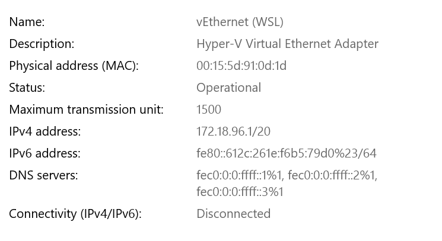
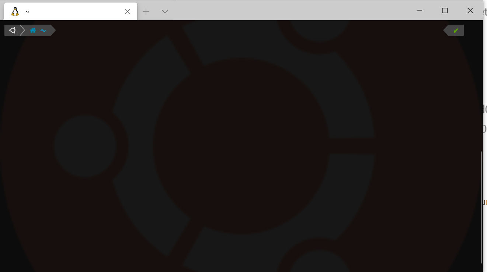

# Windows Subsystem for Linux Installation

[Microsoft WSL installation Guide](https://docs.microsoft.com/en-us/windows/wsl/install-win10)

After Step 1 and Step 3, the environment is set.

```bash
dism.exe /online /enable-feature /featurename:Microsoft-Windows-Subsystem-Linux /all /norestart
```

```bash
dism.exe /online /enable-feature /featurename:VirtualMachinePlatform /all /norestart
```

Download Linux kernel. If you want, you can set WSL to version 2.

The default path where distribution install is system disk, but you can manually install them at where you want.

[Manually install distribution](https://docs.microsoft.com/zh-cn/windows/wsl/install-manual)

Windows Terminal has great features. I set wsl2 terminal as default. This is my Windows Terminal setting.

```json
{
    "defaultProfile": "{wsl guid}", // enter wsl guid in {}
    "initialCols": 90,
    "initialRows": 22,
	...

    "profiles":
    {
        "defaults":
        {
            // Put settings here that you want to apply to all profiles.
        },
        "list":
        [
            {
                "guid": "{wsl guid}",
                "hidden": false,
                "name": "Ubuntu-20.04",
                "source": "Windows.Terminal.Wsl",
                "fontFace": "MesloLGS NF",
                "backgroundImage" : "image path",
                "backgroundImageOpacity" : 0.05,
                "historySize": 9001,
                "cursorColor" : "#FFFFFF",
                "cursorShape" : "bar",
                "commandline": "vhdx disk path",
                "tabTitle" : "Ubuntu"
            },
            ...
         ]
         ...
    }
}            
```

 

## Proxy in WSL

### allow client in LAN in host OS proxy

### access firewall

windows `view your network properties`



`Windows Defender Firewall with Advanced Security`. Add an Inbound Rules `WSL`.

1. custom
2. all program
3. next
4. local IP: Any IP, remote IP: These IP address, which contains wsl address above. 
5. next
6. three of them
7. set name

Then in WSL you can `ping` host OS IP. You can use proxy by `<IP:Port>`.

## Customize Linux

I use [p10k](https://github.com/romkatv/powerlevel10k) which needs `oh-my-zsh` and `MesloLGS NF` font.




